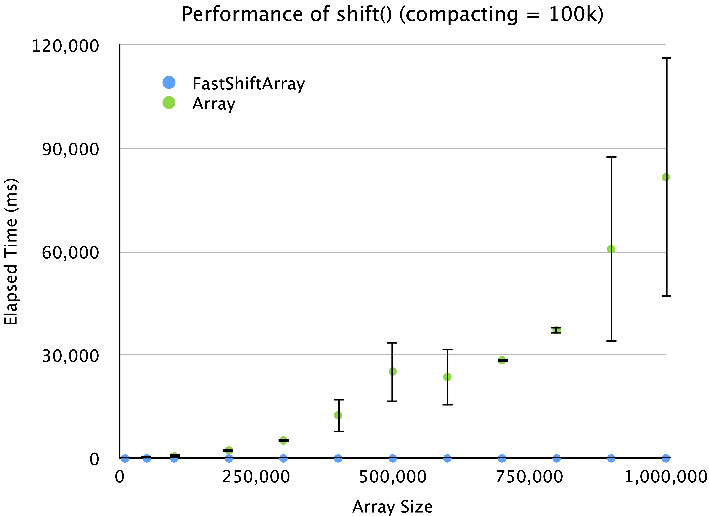
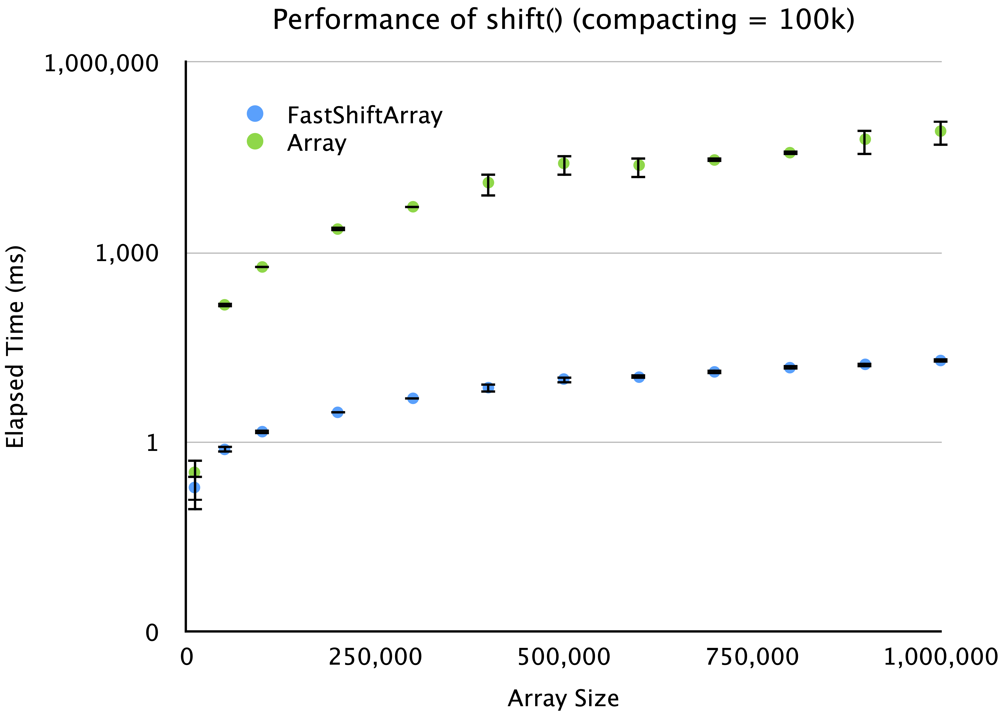
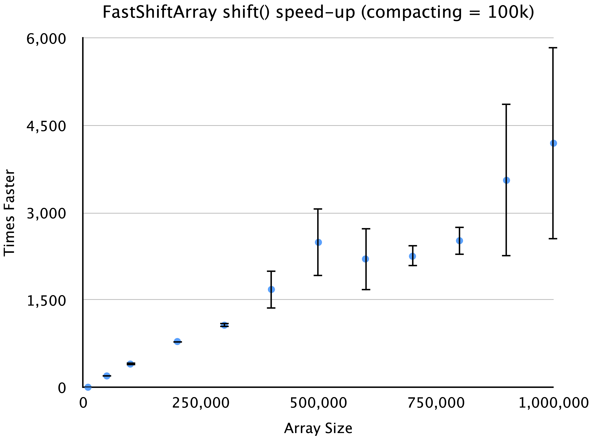

# FastShiftArray

This implementation is designed to be a lightweight alternative to the standard JavaScript `Array` class, with a focus on performance and ease of use. It is particularly useful in scenarios where frequent shift operations are required, such as in data processing, event handling, and other applications where performance is critical. This drop-in replacement for the JavaScript `Array` class provides fast (approximate `O(1)`) `shift()` operations, and in some cases similar `O(1)` `unshift()` operations.

## use

```shell
npm install fast-shift-array
```

[Documentation](https://robphilipp.github.io/fast-shift-arrary/index.html)

## performance comparison

Comparision of the `FastShiftArray.shift()` and `Array.shift()` function. Each table represents a comparisons of various
array sizes, for which half the array elements where shifted out of the array, through repeated calls to the `shift()`
function. Each row of each table represents 10 runs for the specified array size and number of shifts. The values are
the average number of milliseconds it took to complete all the shifts, followed by ± one standard-deviation.

The first table uses a `compacting size` of 10<sup>5</sup>. This means that after 10<sup>5</sup> shifts, the first
10<sup>5</sup> elements are dropped using an `Array.splice()` function. The next table uses a `compacting size` of
10<sup>4</sup>, and then the next table uses a `compacting size` of 1,000, and then 100.

### FastShiftArray compacts when head = 100,000

| Array Size | Num Shifts | FastShiftArray (ms) |            Array (ms) |            Speed-up |
|-----------:|-----------:|--------------------:|----------------------:|--------------------:|
|     10,000 |      5,000 |         0.19 ± 0.11 |           0.33 ± 0.21 |         1.76 ± 0.16 |
|     50,000 |     25,000 |         0.76 ± 0.10 |         146.66 ± 2.32 |      196.21 ± 18.51 |
|    100,000 |     50,000 |         1.45 ± 0.02 |         581.62 ± 9.62 |       400.07 ± 4.05 |
|    200,000 |    100,000 |         2.93 ± 0.04 |      2,309.18 ± 19.80 |      787.30 ± 14.19 |
|    300,000 |    150,000 |         4.88 ± 0.21 |      5,202.80 ± 54.74 |    1,067.76 ± 39.13 |
|    400,000 |    200,000 |         7.19 ± 1.42 |  12,521.91 ± 5,009.20 |   1,682.12 ± 326.29 |
|    500,000 |    250,000 |         9.83 ± 1.35 |  25,242.45 ± 8,692.55 |   2,491.91 ± 583.89 |
|    600,000 |    300,000 |        10.54 ± 0.84 |  23,641.16 ± 8,428.45 |   2,205.86 ± 531.73 |
|    700,000 |    350,000 |        12.77 ± 1.29 |    28,522.37 ± 648.12 |   2,252.48 ± 181.72 |
|    800,000 |    400,000 |        14.89 ± 1.29 |    37,223.47 ± 782.26 |   2,519.99 ± 236.51 |
|    900,000 |    450,000 |        16.81 ± 1.57 | 60,779.80 ± 27,139.28 | 3,558.00 ± 1,315.03 |
|  1,000,000 |    500,000 |        19.32 ± 1.15 | 81,686.76 ± 34,683.43 | 4,194.94 ± 1,660.87 |

<figure>
    
    <figcaption>
        <b>Figure 1</b>. <code>FastShiftArray.shift()</code> performance versus JavaScript <code>Array.shift()</code> performance. Each data point is calculated for an array size and then calling the shift() function half as many times as the array size. For example, when the array size is 100,000, then the <code>shift()</code> function is called 50,000 times. Each data point shows the mean-value for 10 runs, and the error bars represent plus/minus one standard deviation. In this run, the compacting-size is 100k, which means that after 100k calls to the <code>FastShiftArray.shift()</code>, the shifted memory is reclaimed using the <code>splice()</code> function.
    </figcaption>
</figure>
<figure>
    
    <figcaption>
        <b>Figure 2</b>. <code>FastShiftArray.shift()</code> performance versus JavaScript <code>Array.shift()</code> performance. This figure is the same as <b>Figure 1</b>, except that the y-axis is shown as a logarithmic scale. Each data point is calculated for an array size and then calling the <code>shift()</code> function half as many times as the array size. For example, when the array size is 100,000, then the shift() function is called 50,000 times. Each data point shows the mean-value for 10 runs, and the error bars represent plus/minus one standard deviation. In this run, the compacting-size is 100k, which means that after 100k calls to the <code>FastShiftArray.shift()</code>, the shifted memory is reclaimed using the <code>splice()</code> function.
    </figcaption>
</figure>
<figure>
    
    <figcaption>
        <b>Figure 3</b>. Shows the number of times that the <code>FastShiftArray.shift()</code> is faster than the JavaScript <code>Array.shift()</code>. Each data point is calculated for an array size and then calling the shift() function half as many times as the array size. For example, when the array size is 100,000, then the <code>shift()</code> function is called 50,000 times. Each data point shows the mean-value for 10 runs, and the error bars represent plus/minus one standard deviation. In this run, the compacting-size is 100k, which means that after 100k calls to the <code>FastShiftArray.shift()</code>, the shifted memory is reclaimed using the <code>splice()</code> function.
    </figcaption>
</figure>


### FastShiftArray compacts when head = 10,000

| Array Size | Num Shifts | FastShiftArray (ms) |          Array (ms) |         Speed-up |
|-----------:|-----------:|--------------------:|--------------------:|-----------------:|
|     10,000 |      5,000 |         0.15 ± 0.00 |         0.22 ± 0.01 |      1.52 ± 0.09 |
|     50,000 |     25,000 |         0.74 ± 0.01 |       145.53 ± 1.24 |    195.51 ± 2.03 |
|    100,000 |     50,000 |         1.50 ± 0.05 |       577.66 ± 6.52 |   384.46 ± 11.09 |
|    200,000 |    100,000 |         5.08 ± 0.45 |   4,488.27 ± 692.40 |   876.60 ± 84.75 |
|    300,000 |    150,000 |         4.56 ± 0.11 |    5,175.45 ± 54.34 | 1,136.44 ± 24.96 |
|    400,000 |    200,000 |         6.12 ± 0.15 |    9,189.89 ± 75.51 | 1,502.04 ± 34.50 |
|    500,000 |    250,000 |        10.39 ± 0.16 |  32,347.06 ± 265.23 | 3,114.48 ± 41.13 |
|    600,000 |    300,000 |         9.43 ± 0.16 |  20,807.97 ± 215.47 | 2,206.01 ± 37.60 |
|    700,000 |    350,000 |        13.90 ± 0.17 |  65,655.05 ± 456.49 | 4,725.68 ± 76.48 |
|    800,000 |    400,000 |        12.20 ± 0.25 |  36,956.30 ± 331.51 | 3,029.61 ± 63.40 |
|    900,000 |    450,000 |        17.74 ± 0.31 | 109,389.23 ± 926.44 | 6,167.35 ± 76.99 |
|  1,000,000 |    500,000 |        15.58 ± 0.28 |  58,016.47 ± 658.31 | 3,724.07 ± 63.58 |

### FastShiftArray compacts when head = 1000

| Array Size | Num Shifts | FastShiftArray (ms) |          Array (ms) |          Speed-up |
|-----------:|-----------:|--------------------:|--------------------:|------------------:|
|     10,000 |      5,000 |         0.15 ± 0.00 |         0.22 ± 0.00 |       1.48 ± 0.03 |
|     50,000 |     25,000 |         0.74 ± 0.01 |       145.44 ± 0.62 |     196.03 ± 2.84 |
|    100,000 |     50,000 |         1.49 ± 0.04 |       576.35 ± 1.53 |    386.99 ± 10.14 |
|    200,000 |    100,000 |         5.38 ± 0.27 |    4,744.86 ± 74.10 |    883.71 ± 35.92 |
|    300,000 |    150,000 |         4.54 ± 0.07 |   5,207.01 ± 122.83 |  1,148.37 ± 28.69 |
|    400,000 |    200,000 |         6.35 ± 0.11 |    9,194.31 ± 63.61 |  1,449.43 ± 24.40 |
|    500,000 |    250,000 |        10.38 ± 0.13 |  32,247.87 ± 175.34 |  3,108.41 ± 33.56 |
|    600,000 |    300,000 |         9.14 ± 0.04 |  20,673.69 ± 101.21 |  2,261.81 ± 14.28 |
|    700,000 |    350,000 |        14.02 ± 0.17 |  65,495.56 ± 213.67 |  4,672.08 ± 59.80 |
|    800,000 |    400,000 |        12.52 ± 0.07 |  36,892.13 ± 274.72 |  2,947.53 ± 25.56 |
|    900,000 |    450,000 |        17.68 ± 0.38 | 108,960.67 ± 286.28 | 6,164.14 ± 127.86 |
|  1,000,000 |    500,000 |        15.26 ± 0.11 |  58,560.16 ± 901.81 |  3,838.26 ± 65.69 |

### FastShiftArray compacts when head = 100

| Array Size | Num Shifts | FastShiftArray (ms) |          Array (ms) |          Speed-up |
|-----------:|-----------:|--------------------:|--------------------:|------------------:|
|     10,000 |      5,000 |         0.15 ± 0.00 |         0.22 ± 0.00 |       1.44 ± 0.04 |
|     50,000 |     25,000 |         0.75 ± 0.01 |       145.33 ± 0.39 |     194.69 ± 2.58 |
|    100,000 |     50,000 |         1.50 ± 0.02 |       576.41 ± 3.01 |     385.17 ± 3.24 |
|    200,000 |    100,000 |         5.25 ± 0.09 |    4,728.47 ± 20.44 |    900.49 ± 17.42 |
|    300,000 |    150,000 |         4.67 ± 0.11 |    5,191.95 ± 54.82 |  1,111.66 ± 27.32 |
|    400,000 |    200,000 |         6.37 ± 0.08 |   9,235.89 ± 177.75 |  1,450.07 ± 19.89 |
|    500,000 |    250,000 |        10.80 ± 0.65 |   32,178.85 ± 53.26 | 2,989.18 ± 160.44 |
|    600,000 |    300,000 |         9.29 ± 0.20 |   20,645.45 ± 85.35 |  2,224.45 ± 50.57 |
|    700,000 |    350,000 |        14.33 ± 0.37 |  65,346.82 ± 109.40 | 4,562.19 ± 113.05 |
|    800,000 |    400,000 |        12.90 ± 0.69 |  36,871.75 ± 367.28 | 2,865.20 ± 130.48 |
|    900,000 |    450,000 |        17.78 ± 0.16 | 108,940.82 ± 415.86 |  6,128.48 ± 61.86 |
|  1,000,000 |    500,000 |        15.82 ± 0.35 |  58,032.08 ± 261.73 |  3,670.83 ± 78.81 |


